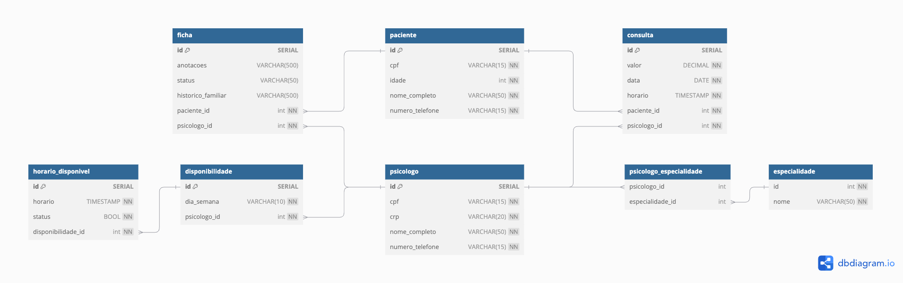
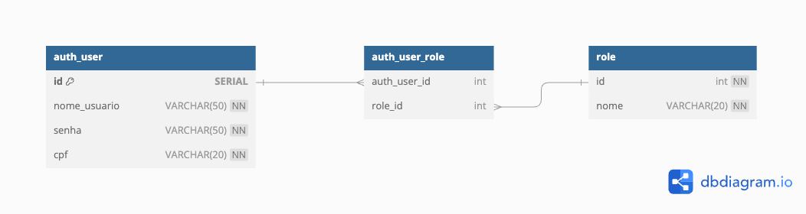
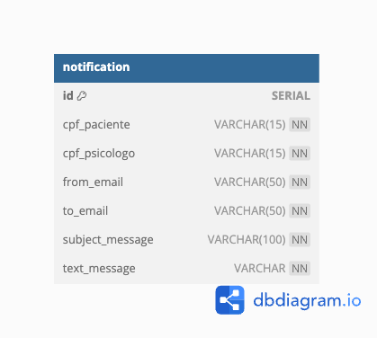

# Projeto Mental Health

## Visão Geral do Sistema

##### O objetivo deste projeto é criar um sistema para a clínica psicológica Mental Health que visa facilitar o agendamento de consultas, o gerenciamento de disponibilidade dos psicólogos, e a adiministração do histórico e informações dos pacientes.

## Diagrama de Caso de Uso

#### [Clique aqui](./especificacao_casos_de_uso.md) para consultar a especifição dos casos de uso.

## Diagrama de Entidade Relacionamento

### Core

Acesse este diagrama [aqui](https://dbdiagram.io/d/mental_health_core-66c7bad1a346f9518cd73142).

### User Auth

Acesse este diagrama [aqui](https://dbdiagram.io/d/mental_health_user_auth-66ddb5c5eef7e08f0e0b97b4).

### Notification

Acesse este diagrama [aqui](https://dbdiagram.io/d/mental_health_notification-66ddb945eef7e08f0e0bcd7d).